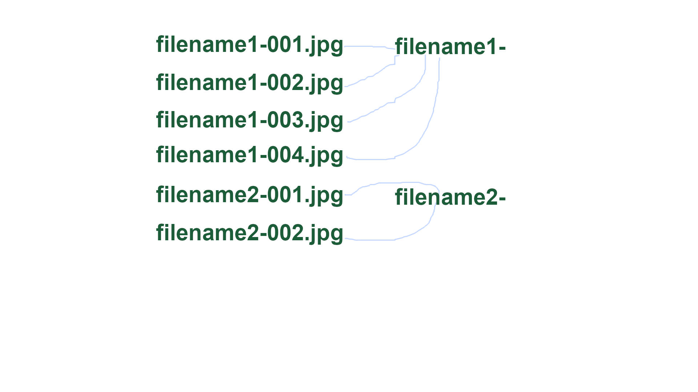

# rename_files_tor_dir

Rename files and move to catalog 

name1-001.jpg -> name1- 

name1-002.jpg -> name1- 

name1-003.jpg -> name1- 

name1-004.jpg -> name1- 

name2-001.jpg -> name2- 

name2-002.jpg -> name2- 

name2-003.jpg -> name2- 

name4-001.jpg -> name4- 

name5-002.jpg -> name5- 

name5-003.jpg -> name5-

# Usage

download files

edit file 
```PHP
...
$dir = 'z:/upl2';
$num_str_count = 4; // 4 - name1-0001.jpg , 3 - name1-001.jpg , 2 - name1-01.jpg 
...
```

